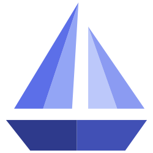
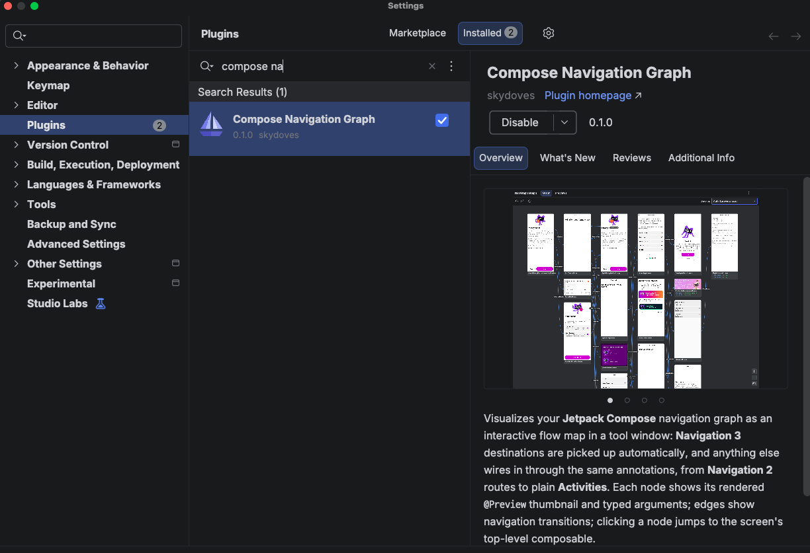
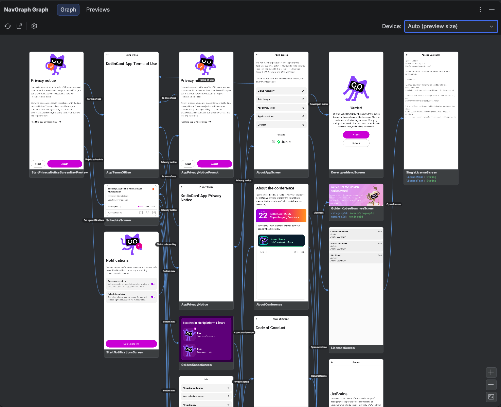
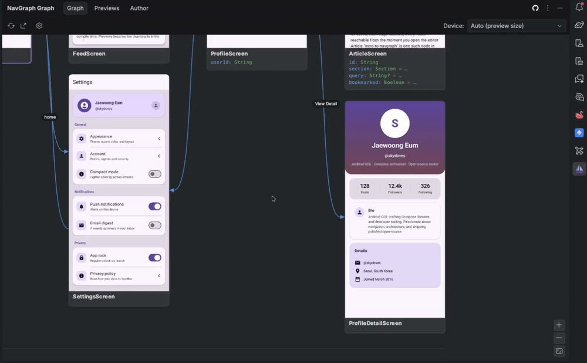
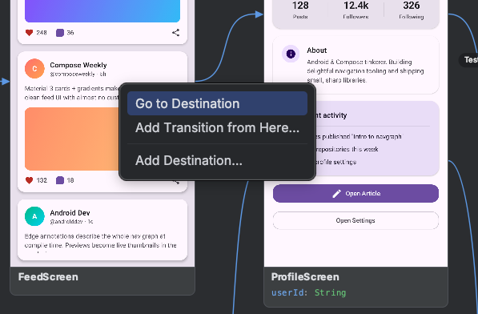
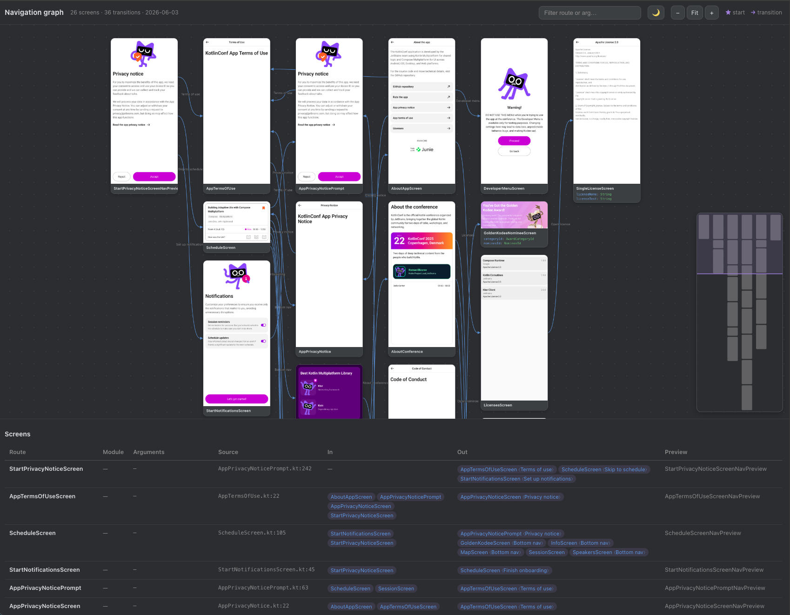
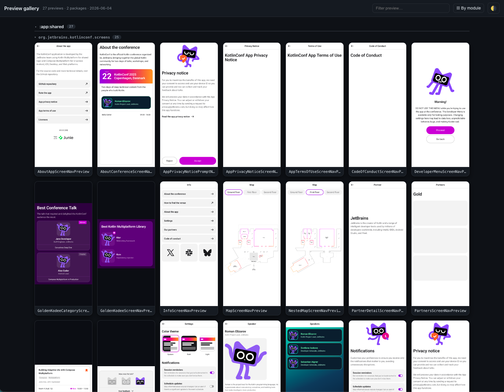
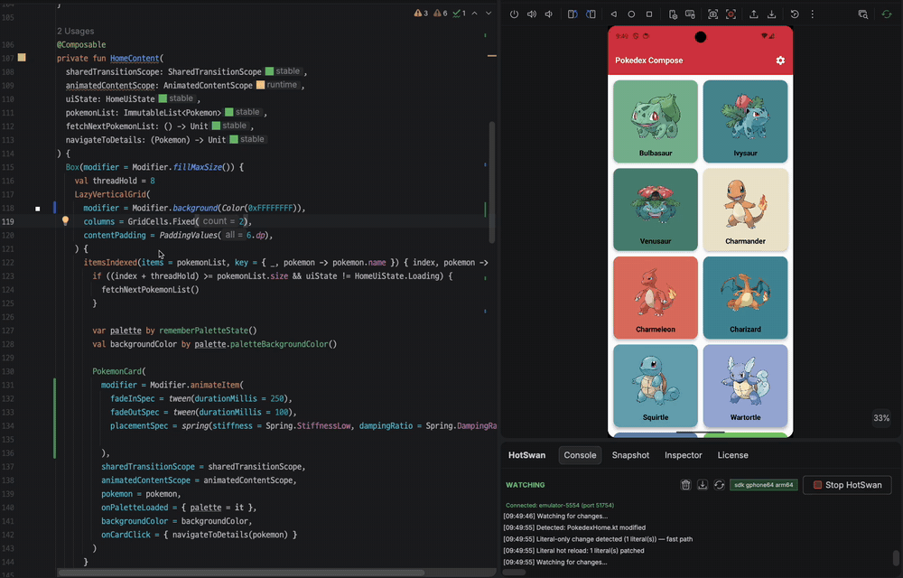

<p align="center">

</p>

<h1 align="center">Compose Navigation Graph</h1>

<p align="center">
  <a href="https://opensource.org/licenses/Apache-2.0"></a>
  <a href="https://android-arsenal.com/api?level=24"></a>
  <a href="https://central.sonatype.com/artifact/com.github.skydoves/compose-nav-graph-annotations"></a>
  <a href="https://github.com/skydoves"></a>
</p>

<p align="center">
Compose Navigation Graph turns your entire app flow into one <b>living map</b>: every screen as a rendered existing
<code>@Preview</code> thumbnail, every transition an arrow you can follow. It works with <b>Navigation 3</b>,
<b>Navigation 2</b>, any other Compose navigation libraries, and even plain Activities.<br><br> You annotate your
screens, and a Gradle plugin and KSP processor statically extract the navigation graph and render a
<b>device free thumbnail</b> of every screen, with no emulator. An IntelliJ / Android Studio plugin then draws
your whole app's navigation, merged across modules, in a tool window where you jump to the source and add
transitions. You can even validate navigation changes in pull requests with a committed <code>.nav</code> baseline,
so no destination or transition changes unreviewed.
</p>


The full documentation, covering the annotations, the `navgraph { }` DSL, the `.nav` baseline, the exports, and the
IDE plugin, is available at **[skydoves.github.io/compose-nav-graph](https://skydoves.github.io/compose-nav-graph/)**.

> [!TIP]
> Want to set everything up in one shot with AI? Throw **[plugin-agent-guides.md](plugin-agent-guides.md)** at your
> LLM (Claude Code, Cursor, Gemini CLI, ...) as-is, and it will apply the Gradle plugin, annotate your screens, and
> generate your first graph for you.

## 💝 Sponsors

The sponsors listed below made it possible for this project to be released as open source. Many thanks to all of them for their support!

<a href="https://coderabbit.link/Jaewoong" target="_blank"> </a>

**[CodeRabbit](https://coderabbit.link/Jaewoong)** is an AI-powered code review platform that integrates directly into pull-request workflows and IDEs, examining code changes in context and suggesting improvements.

## Compose Navigation Graph Plugin

The Compose Navigation Graph IntelliJ plugin brings your app's **whole navigation flow** directly into Android Studio
or IntelliJ IDEA. Instead of reconstructing the flow in your head from `entry<Route> { }` lambdas and
`backStack.add(...)` call sites scattered across modules, you get one interactive canvas: every destination with its
rendered thumbnail and typed arguments, every transition between screens, and a double click to jump straight to the
code.

The toolkit is made of four cooperating pieces. You apply the Gradle plugin (which adds the annotations and the KSP
processor for you) and install the IDE plugin:

- **Annotations** (`com.github.skydoves:compose-nav-graph-annotations`): `@NavDestination`, `@NavEdge`, `@NavPreview`, and `@NavGraphRoot` describe your graph in code. Added automatically.
- **KSP processor** (`com.github.skydoves:compose-nav-graph-ksp`): statically extracts each module's graph to `nav-graph.json` at compile time. Added automatically.
- **Gradle plugin** (`id("com.github.skydoves.navgraph")`): renders device free Layoutlib thumbnails, merges the graph across modules, and provides the `generateNavGraph`, `navDump`, `navCheck`, and export tasks.
- **IDE plugin** (`compose-nav-graph-idea`): draws the merged flow graph and the preview gallery in the **NavGraph Graph** tool window.

### How to Install in Android Studio

You can install the plugin directly from the **[JetBrains Marketplace](https://plugins.jetbrains.com/plugin/32224-compose-navigation-graph/)**:

Open **Android Studio** (or IntelliJ IDEA) > **Settings** > **Plugins** > **Marketplace** > search for **Compose Navigation Graph** > **Install**.



Once installed, open **View → Tool Windows → NavGraph Graph**. If you see the **Graph**, **Previews**, and **Author**
tabs, you're all set! 🎉

## Gradle Plugin

[](https://central.sonatype.com/artifact/com.github.skydoves/compose-nav-graph-annotations)

Make sure `mavenCentral()` is in your plugin repositories:

```kotlin
// settings.gradle.kts
pluginManagement {
    repositories {
        google()
        mavenCentral()
        gradlePluginPortal()
    }
}
```

Then apply the plugin and KSP to the module that holds your screens. That's all.

```kotlin
// build.gradle.kts
plugins {
    id("com.google.devtools.ksp") version "<matching your Kotlin version>"
    id("com.github.skydoves.navgraph") version "0.1.0"
}
```

### Configure

```kotlin
navgraph {
    renderThumbnails.set(true)  // device free Layoutlib thumbnails (default true)
    variant.set("demoDebug")  // pin a flavor; blank auto detects the debug KSP variant
    failOnNavChange.set(true)  // navCheck fails the build when the graph drifts (default true)
    galleryEnabled.set(true)  // the preview gallery pipeline (default true)
}
```

## Navigation Graph

The **Graph** tab supports multi-module architecture, and merges every module's graph into one canvas, even when the `:app` module itself isn't annotated. Also it shows screen thumbnails, typed argument nodes, and the transitions between them. You double click a node to jump to its source, add a transition straight from the graph, and reframe the thumbnails with the device selector. The refresh button runs `generateNavGraph` for you, so the canvas always reflects your latest code.



### Annotate your screens

```kotlin
@NavGraphRoot  // marks the start destination
@NavDestination(route = HomeRoute::class)  // this composable is the node for HomeRoute
@NavEdge(to = DetailRoute::class, label = "Open")  // a transition (repeatable)
@Composable
fun HomeScreen(/* … */) { /* … */ }

@NavPreview(route = HomeRoute::class, primary = true)
@Preview
@Composable
fun HomeScreenPreview() { /* … */ }
```

Each annotation plays one role in the graph:

- **`@NavDestination(route = ...)`**: declares the composable that renders a route. The route class becomes a node in the graph, its serializable properties become the node's typed arguments, and double clicking the node in the IDE jumps to this composable.
- **`@NavEdge(to = ..., from = ..., label = ...)`**: declares a transition between two routes, drawn as an arrow in the graph. It's repeatable, so one screen can declare several outgoing transitions. When `from` is omitted, it's inferred from the annotated declaration, and `label` names the arrow (for example, the button that triggers it).
- **`@NavGraphRoot`**: marks the start destination, where the flow begins. The IDE highlights it with a star.
- **`@NavPreview(route = ..., primary = ...)`**: links a `@Preview` composable to a route so its rendered thumbnail appears on the node. When a route has several previews, `primary = true` picks the one shown on the graph.

A route can be any class. It does not need to implement `NavKey`, so an existing app (Navigation 2 routes, or even
plain Activities referenced by `@NavEdge`) lights up without refactoring.

### Add destinations and transitions from the IDE

You don't even have to write the annotations by hand: the graph canvas is editable. Drag the connector handle on a
node's right edge and drop it onto another screen, and the plugin inserts the matching `@NavEdge(to = ...)` into your
source code, refreshes the graph, and draws the new arrow. Adding a destination works the same way: the plugin
scaffolds a new route class plus its `@NavDestination` screen stub, and the node appears on the canvas:



The same edits are available from the right click menu. **Add Transition from Here…** lists every screen, and picking
one writes the annotation and re-renders the result. **Add Destination…** scaffolds a new destination, **Wire This
Up…** scaffolds the `@NavDestination` screen for an orphan route, and **Go to Destination** jumps to the code:



### Generate the graph

On the IDE side, you can generate the whole navigation graph by clicking the refresh icon, and you can also generate the graph with the Gradle task below:

```bash
./gradlew :app:generateNavGraph
```

This writes `nav-graph.json` plus a device free Layoutlib thumbnail per screen. You open the **NavGraph Graph** tool
window to explore it, or [export it as a standalone artifact](#export-your-navigation-graph-or-preview-gallery).

## Preview Gallery

The **Previews** tab renders **every `@Preview` in your project**, not just the annotated screens, grouped by module
and package. It's a living design system overview: scan all screens and components at a glance, and jump to a
preview's source with a double click. Multipreview annotations are expanded, and `@PreviewParameter` providers are
honored.


### Generate the preview gallery

The same pipeline can render **every `@Preview` in your project** into a gallery, grouped by module and package:

```bash
./gradlew :app:generatePreviewGallery  # render every @Preview into build/navgallery
```

## Export your navigation graph or preview gallery

Everything the tool window shows can also leave the IDE as a standalone artifact, ready to drop into a pull request,
a design review, or your team's wiki. Export the navigation graph as an interactive HTML page or a single PNG. You can directly export on your IDE by clicking the sharing icon, but also you can export them with the Gradle tasks below:

```bash
./gradlew :app:exportNavGraphHtml  # a standalone interactive HTML canvas
./gradlew :app:exportNavGraphImage  # a single PNG of the whole graph
```

The HTML export is a self-contained interactive page: pan and zoom the flow map, filter routes, and read the screens
table with every argument, transition, and source location:



The preview gallery exports the same way, as a browsable HTML gallery or a single PNG contact sheet:

```bash
./gradlew :app:exportPreviewGalleryHtml  # a standalone HTML gallery
./gradlew :app:exportPreviewGalleryImage  # a single PNG contact sheet
```



## Navigation Validation

A navigation change is otherwise invisible in review: a new destination, a changed typed argument, an added or
removed transition. You commit a `.nav` baseline (modeled on `apiDump` and `apiCheck`) so a `git diff` shows
exactly how navigation changed, and `check` fails when the baseline is out of date:

```bash
./gradlew :app:navDump  # write or update the committed baseline (app/nav/app.nav)
./gradlew :app:navCheck  # verify it; wired into check, so it fails on drift
```

Both tasks read the statically extracted graph directly and never render thumbnails, so they're fast enough to run on
every `check` and every CI build. The committed `.nav` baseline is intentionally human readable, so a pull request
diff reads like a description of your app's flow:

```
dest Article  args=(id: String, section: Section = …, query: String? = …)
dest Home  start
dest Profile  args=(userId: String)
edge Feed -> Profile
edge Home -> Feed
edge Profile -> Article  "Open article"
edge Settings -> Home  "home"
```

When the graph drifts from the baseline, `navCheck` prints a `- removed` / `+ added` diff and fails the build, so the
change has to be reviewed and the baseline deliberately updated with `navDump`:

```
navgraph: navigation graph changed — app/nav/app.nav is out of date:

  - edge Profile -> Settings
  + dest Onboarding
  + edge Home -> Onboarding  "first run"

Run :app:navDump to update the baseline, then review the diff.
```

Two knobs tune the workflow: strict on CI but warning only locally, and gradual adoption across modules:

```kotlin
navgraph {
    failOnNavChange.set(System.getenv("CI") == "true")  // fail the build on CI, warn locally
    allowMissingBaseline.set(true)  // skip modules that haven't committed a baseline yet
}
```

The full guide, including multi module baselines and CI integration, lives in the
**[Nav Baseline documentation](https://skydoves.github.io/compose-nav-graph/gradle-plugin/baseline/)**.

## Documentation

The full documentation covers the annotations, the `navgraph { }` DSL, the `.nav` baseline, the exports, and the IDE
plugin at **[skydoves.github.io/compose-nav-graph](https://skydoves.github.io/compose-nav-graph/)**. Runnable demos live in
[`samples/sample/`](samples/sample), [`samples/sample-kotlinconf/`](samples/sample-kotlinconf) for Kotlin Multiplatform, and
[`samples/sample-nowinandroid/`](samples/sample-nowinandroid) for a multi module setup.

## More Plugins by the Author

If you find this plugin useful, check out the author's other developer tools for Jetpack Compose.

### Compose Hot Reload for Android (HotSwan)

**[HotSwan](https://hotswan.dev/)** hot reloads your Compose code on a real device or emulator in seconds. UI changes
appear instantly while the app keeps its navigation and runtime state, with no reinstall or restart:



### Compose Stability Analyzer

**[Compose Stability Analyzer](https://github.com/skydoves/compose-stability-analyzer)** analyzes the stability of
your composables and visualizes recompositions in real time, with inline stability hints, recomposition counts, and
quick fixes right inside Android Studio:


## Find this library useful? :heart:

Support it by joining __[stargazers](https://github.com/skydoves/compose-nav-graph/stargazers)__ for this repository. :star: <br>
Also, __[follow me](https://github.com/skydoves)__ on GitHub for my next creations! 🤩

# License

```xml
Designed and developed by 2026 skydoves (Jaewoong Eum)

Licensed under the Apache License, Version 2.0 (the "License");
you may not use this file except in compliance with the License.
You may obtain a copy of the License at

    https://www.apache.org/licenses/LICENSE-2.0

Unless required by applicable law or agreed to in writing, software
distributed under the License is distributed on an "AS IS" BASIS,
WITHOUT WARRANTIES OR CONDITIONS OF ANY KIND, either express or implied.
See the License for the specific language governing permissions and
limitations under the License.
```
