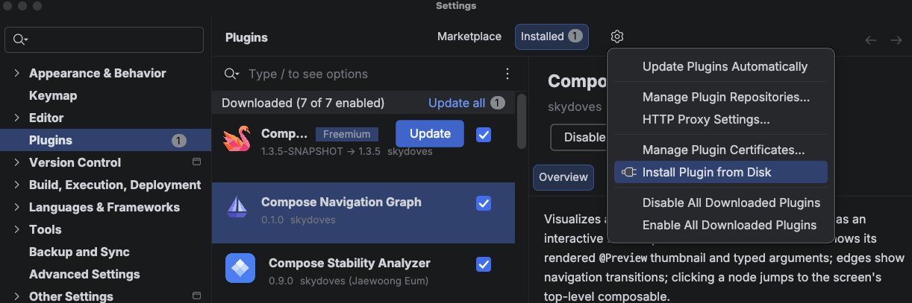

# Getting Started

The Compose Navigation Graph IDE plugin brings your app's flow graph **directly into Android Studio or IntelliJ IDEA**. It reads the graph produced by the Gradle plugin and draws it in an interactive **NavGraph Graph** tool window with three tabs:

- **Graph**: the whole app's merged flow map, with every destination's rendered thumbnail and typed arguments, the transitions between screens, and a double click to jump straight to the code. See [NavGraph Graph](graph.md).
- **Previews**: every `@Preview` in your project, rendered and grouped by module and package. See [Preview Gallery](preview-gallery.md).
- **Author**: a short introduction to the plugin and its author.

## Installation

Install the plugin from the **[JetBrains Marketplace](https://plugins.jetbrains.com/plugin/32224-compose-navigation-graph/)**: open **Android Studio** (or IntelliJ IDEA) > **Settings** > **Plugins** > **Marketplace**, search for **Compose Navigation Graph**, and click **Install**. Restart your IDE when prompted.

If you prefer a specific build, you can also install from disk:

1. Download a `compose-nav-graph-idea-*.zip` from the **[releases page](https://github.com/skydoves/compose-nav-graph/releases)**.
2. Open **Settings** > **Plugins** > click the **⚙️ gear icon** > **Install Plugin from Disk…**.
3. Select the downloaded zip and restart your IDE when prompted.



## Prerequisites

The IDE plugin **draws** the graph; the [Gradle plugin](../gradle-plugin/getting-started.md) **produces** it. So before the tool window can show anything, your project needs the Gradle plugin applied and the graph generated:

```bash
./gradlew :app:generateNavGraph
```

This writes `build/navgraph/nav-graph.json` (and thumbnails), which the tool window reads. If the plugin can't find a generated graph, the tool window shows a short setup guide with a one click link instead of a blank panel.

!!! note "Refresh runs Gradle for you"

    You don't have to run the Gradle task by hand each time. By default, the **Refresh** button in the tool window runs `generateNavGraph` itself and reloads the result, so you can stay in the IDE. (This is configurable. See [Settings](graph.md#settings).)

!!! tip "Set everything up in one shot with AI"

    Paste **[plugin-agent-guides.md](https://github.com/skydoves/compose-nav-graph/blob/main/plugin-agent-guides.md)** into your LLM (Claude Code, Cursor, Gemini CLI, ...) as-is, and it will apply the Gradle plugin, annotate your screens, and generate your first graph for you.

## Open the Tool Window

Open **View** > **Tool Windows** > **NavGraph Graph** (the tool window is anchored on the right side of the IDE by default). Click it to open the panel, then press **Refresh** to generate and load your graph.

Once loaded, the **Graph** tab shows your app's flow map: nodes for each destination, curved arrows for the transitions, and a highlighted start node. From here you can pan, zoom, double click a node to jump to its source, and drag a connector to add a new transition. See [NavGraph Graph](graph.md) for everything the Graph tab can do, and [Preview Gallery](preview-gallery.md) for the **Previews** tab.
