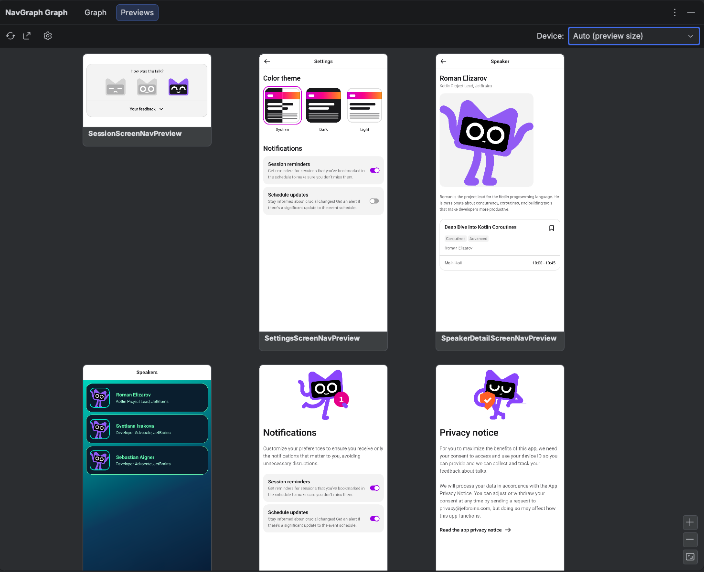

# Preview Gallery

The **Previews** tab of the **NavGraph Graph** tool window renders **every `@Preview` in your project**, not just the screens you annotated for the graph, grouped by module and package. It's a living design system overview: scan all your screens and components at a glance, and jump to any preview's source with a **double click**.



A few things happen automatically:

- **Multipreview meta-annotations are expanded.** A composable annotated with, say, a custom `@ThemePreviews` annotation shows up once per underlying `@Preview` it declares.
- **`@PreviewParameter` providers are honored**, so previews driven by sample data render with that data.
- **Every module contributes.** The gallery merges per-module results into one view, with a section header per module, ordered by module and package.

## Open It

Open **View** > **Tool Windows** > **NavGraph Graph** and switch to the **Previews** tab. The canvas works just like the [Graph tab](graph.md): **drag to pan**, **wheel to zoom** (or the zoom buttons in the bottom right corner), and the **Device** combo reframes every thumbnail to a chosen device aspect ratio. There are no edges or transitions here, just the previews themselves.

If you haven't installed the IDE plugin yet, see [Getting Started](getting-started.md#installation).

## How the Data Is Produced

The gallery is generated by the Gradle plugin, the same device free Layoutlib pipeline that renders the graph thumbnails, so no emulator or device is needed:

```bash
./gradlew :app:generatePreviewGallery
```

This renders every `@Preview` into `build/navgallery` along with a manifest the IDE reads. You usually don't run it by hand: the tab's **Refresh** button runs `generatePreviewGallery` for you and reloads the result.

!!! note "On demand only"

    The gallery tasks are never wired into `generateNavGraph` or `check`, so they cost nothing unless you run them. If you don't want them registered at all, set `galleryEnabled.set(false)` in the `navgraph { }` block.

## Export the Gallery

The gallery exports to standalone artifacts, either from the tab's **Export…** toolbar action or directly from the command line:

```bash
./gradlew :app:exportPreviewGalleryHtml  # a standalone HTML gallery
./gradlew :app:exportPreviewGalleryImage  # a single PNG contact sheet
```

The HTML export is a self-contained page you can open anywhere (attach it to a PR, drop it in a design review), with the same module and package grouping as the tab:


## See Real Generated Output

The [nav-results/](https://github.com/skydoves/compose-nav-graph/tree/main/nav-results) directory contains committed gallery exports from real-world projects (the KotlinConf app, Now in Android, and SimpMusic) under `nav-results/preview-gallery/`, alongside their full navigation graphs under `nav-results/nav-graphs/`.
