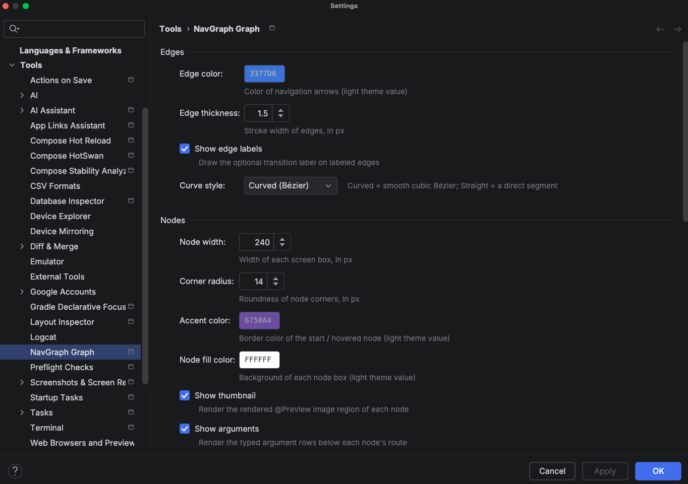

# Settings

Everything about how the **NavGraph Graph** tool window draws and behaves can be tuned under
**Settings** > **Tools** > **NavGraph Graph**. Settings are stored **per project** in the workspace file, so they
never pollute a shared `.idea` checkout, and applying them repaints an open tool window live, with no restart or
refresh needed.

## Edges

How the transition arrows between screens are drawn.

| Setting | Default | What it does |
|---------|---------|--------------|
| **Edge color** | `3377D6` | Color of navigation arrows (the light theme value; the dark variant is derived) |
| **Edge thickness** | `1.5` | Stroke width of edges, in px (`0.5` to `6.0`) |
| **Show edge labels** | on | Draw the optional transition label (from `@NavEdge(label = ...)`) on labeled edges |
| **Curve style** | Curved (Bézier) | `Curved` draws a smooth cubic Bézier; `Straight` draws a direct segment |

## Nodes

How each destination box looks.

| Setting | Default | What it does |
|---------|---------|--------------|
| **Node width** | `240` | Width of each screen box, in px (`160` to `400`) |
| **Corner radius** | `14` | Roundness of node corners, in px (`0` to `24`) |
| **Accent color** | `6750A4` | Border color of the start / hovered node (light theme value) |
| **Node fill color** | `FFFFFF` | Background of each node box (light theme value) |
| **Show thumbnail** | on | Render the `@Preview` image region of each node |
| **Show arguments** | on | Render the typed argument rows below each node's route |
| **Emphasize start destination** | on | Give the start node the accent border and a ★ glyph |

Turning **Show thumbnail** and **Show arguments** off gives you a dense, structure only layout, which is useful for
very large graphs where you care about the shape of the flow more than the screen contents.

## Layout

How nodes are arranged on the canvas.

| Setting | Default | What it does |
|---------|---------|--------------|
| **Column gap** | `90` | Horizontal spacing between depth columns, in px (`40` to `200`) |
| **Row gap** | `26` | Vertical spacing between stacked nodes, in px (`8` to `80`) |
| **Direction** | Left to right | The axis the graph flows along: `Left to right` or `Top to bottom` |
| **Auto-fit** | On first load | When the view auto-zooms to frame the whole graph: `On first load`, `On every refresh`, or `Never` |

## Theme

| Setting | Default | What it does |
|---------|---------|--------------|
| **Theme mode** | Follow IDE | `Follow IDE` swaps light/dark with your IDE theme; `Always light` / `Always dark` pin it |
| **Background color** | `FBFCFE` | Canvas background (light theme value) |

All color settings store the **light theme** value; the plugin derives a matching dark variant automatically when
the dark palette is active.

## Behavior

| Setting | Default | What it does |
|---------|---------|--------------|
| **Refresh action** | Run generateNavGraph | Whether **Refresh** regenerates the graph via Gradle (`Run generateNavGraph`) or just reloads the last output (`Reload existing files`) |
| **Double-click** | Navigate to source | What double clicking a node does: `Navigate to source` or `Do nothing` |

## Export

Defaults used by the tool window's **Export…** action. See [NavGraph Graph](graph.md#export) for the export flow
itself.

| Setting | Default | What it does |
|---------|---------|--------------|
| **Default export device** | empty (Auto) | Device label for the HTML export; empty means Auto, using the device the canvas currently shows |
| **Export output directory** | empty | Directory for the exported HTML; empty means the project base path |
| **Export file name** | `nav-graph.html` | File name of the exported HTML |
